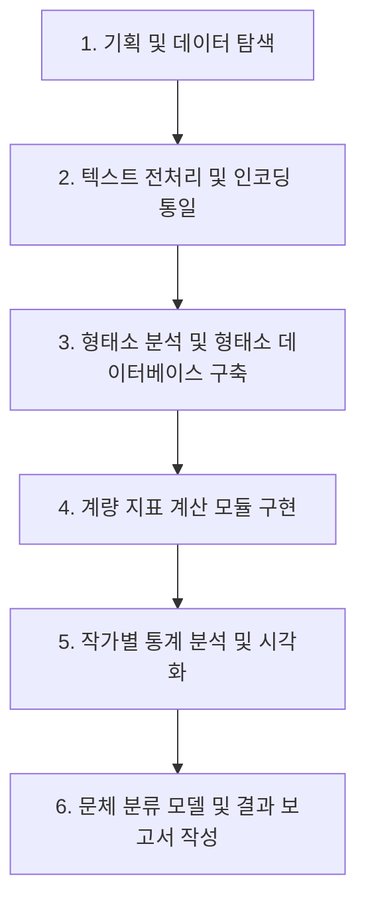

# 소설 문체 계량적 분석 프로젝트 (Stylometry Project)

이 프로젝트는 한국 근현대 소설 작가들의 원본 텍스트 데이터를 바탕으로 문체를 계량적으로 파악하고 분석하여 작가별 문체적 지문(Stylometric Fingerprint)을 규명하는 것을 목적으로 합니다.

## 1. 프로젝트 개요
- **목적**: 57명의 한국 근현대 작가 소설 텍스트를 계량 분석하여 직관에 의존하던 문체 분석을 정량적 지표로 객관화합니다.
- **의도**: 
  - 작가별 어휘 다양성, 문장 구조 특징, 형태소 사용 빈도 등의 차이를 규명합니다.
  - 이를 통해 작가의 집필 스타일을 식별할 수 있는 문체 모델을 구축하고, 작가 미상의 텍스트나 위작 여부 판별, 시대별 문체 변화 연구 등의 토대를 마련합니다.

## 2. 분석 대상 데이터
- **위치**: [raw_novel_limin/](file:///C:/AG/style/raw_novel_limin) 폴더
- **구성**:
  - 총 57개 폴더 (작가별 폴더: 예. `김유정`, `박경리`, `채만식` 등)
  - 각 폴더 내에는 `[연도]_[제목]_[작가].txt` 형식의 소설 원본 텍스트 파일들이 저장되어 있습니다.
  - (참고: 기존에 동봉되어 있던 `.tag` 형식의 형태소 가공 데이터는 분석의 정밀도와 일관성을 위해 모두 삭제되었으며, 원본 `.txt` 텍스트만을 사용하여 새롭게 형태소 분석을 수행합니다.)

## 3. 분석 방식 및 핵심 지표
우리는 Python 환경을 활용하여 원본 텍스트 데이터로부터 다음과 같은 계량적 지표들을 추출하여 분석합니다.

### 3.1. 형태소 분석 및 품사(POS) 태깅
- **분석 도구**: 한국어 형태소 분석기 (`Kiwi`, `KoNLPy`의 `Okt` 또는 `Kkma` 중 환경에 맞춰 선정)
- **주요 지표**:
  - **품사 분포 비율**: 명사(N), 동사(V), 형용사(J), 부사(A), 조사(E) 등의 상대적 빈도 비교.
  - **종결어미 분석**: 문장 끝에 사용되는 종결어미(`-다`, `-요`, `-느냐` 등)의 분포를 통해 문체의 격식이나 어조 분석.
  - **한자어 vs 고유어 비율**: 텍스트 내 한자어와 한글 고유어의 사용 비중 분석.

### 3.2. 어휘 다양성 및 복잡도
- **어휘 다양도 (TTR: Type-Token Ratio)**: 전체 단어 수(Token) 대비 고유 단어 수(Type)의 비율.
- **수정 TTR (Adjusted TTR / MSTTR)**: 텍스트 길이에 따른 왜곡을 방지하기 위해 일정 단위 크기(window)로 나누어 평균 TTR 계산.
- **고유 어휘 사용도**: 특정 작가군 내에서 특정 작가만 고유하게 사용하는 어휘 빈도 분석.

### 3.3. 문장 구조 지표
- **평균 문장 길이**: 온점(`.`), 물음표(`?`), 느낌표(`!`) 등을 기준으로 분리한 문장의 평균 자수/단어 수.
- **문장당 품사 밀도**: 문장 내 조사 및 연결어미의 밀도를 분석하여 문장의 간결성/복잡성 분석.

## 4. 분석 진행 과정 (Roadmap)

- **[완료] 1단계: 기획 및 데이터 탐색**
  - 분석 목적 정의 및 `.tag` 파일 삭제 완료.
  - `style_project.md`를 통한 프로젝트 로드맵 정립.
- **[완료] 2단계: 텍스트 전처리 및 인코딩 통일**
  - 원본 파일이 `cp949` 인코딩임을 파악하고, 파싱 파이프라인 내부에서 디코딩을 안정적으로 처리하여 변환을 완수했습니다.
- **[완료] 3단계: 형태소 분석 및 데이터 가공**
  - `kiwipiepy` 형태소 분석기를 사용하여 원본 텍스트를 문장 단위(줄바꿈 구분)로 분절하였습니다.
  - 오타나 띄어쓰기 교정을 배제하여 문체의 원형을 유지하는 원칙에 따라 순수 형태소와 품사 태그 쌍(`형태/POS`)을 결합하고, 어절 내부의 형태소는 `+` 기호로, 어절 간 공백은 스페이스로 복원하여 `C:/AG/style/segmented_novel_limin/` 하위에 `*_tagged.txt` (UTF-8, BOM 없음) 파일로 400개 파일 전체 변환 완료.
- **[완료] 4단계: 개별 작품 및 작가별 계량 지표 추출**
  - 400개 소설 파일의 문장 분절 데이터를 바탕으로 형태소/품사 빈도, 문장 길이(글자/어절/형태소 수) 분포, 어휘 다양성(TTR) 지표 등을 산출하여 JSON 파일로 저장 완료.
  - 동일 작가의 작품 데이터를 병합(가중 통계 및 빈도 합산)하여 57명의 작가별 종합 문체 프로파일(`*_profile.json`) 생성 완료.
- **[완료] 5단계: 다차원 비교 분석 및 시각화**
  - 1차(기초) 및 2차(현대적) 분석 데이터를 통합하여 주성분 분석(PCA) 및 품사/가독성 히트맵 분석 완료.
  - `modern_authors_comparison.csv`, `modern_author_style_pca.png`, `modern_author_heatmap.png` 생성 완료.
  - 사용자 지침에 따라 '단편인저자' 데이터를 통계 및 시각화 노출 시 완전히 제외함.
  - **문장 종결 방식(명사형, 계사형, 동사형)** 분석을 완료하여 기초 통계에 온전히 포함시킴.
- **[완료] 6단계: 웹 대시보드 구축 및 시연**
  - `publish/` 폴더 하위에 바닐라 HTML5, CSS3, Javascript 및 Chart.js 연동 대시보드 구축 완료.
  - '작가별 분석'의 하위 메뉴로 '기초 계량 및 분석 1', '기초 계량 및 분석 2', '응용 분석'을 구조화하고, '작품별 분석'의 하위 메뉴로 작품 단위 '기초 계량 및 분석 1', '기초 계량 및 분석 2', '응용 분석'을 새로 신설함.
  - 작품별 분석 테이블(기초 1, 기초 2, 응용 분석 전체)에서 '작품명' 다음에 '작가' 항목을 제공하여 작가명 기준의 정렬(소팅)이 가능하도록 설계 및 구현 완료.
  - 인터랙티브 테이블 정렬 기능 및 우측 지표 설명 가이드 패널 구현 완료.
  - 작가별 프로파일 탭에서 자주 사용하는 어미를 상위 8선으로 변경하여 고빈도 어미 8개만 노출되도록 조정 완료.
  - 기초 계량 및 분석 2 탭 및 작품별 기초 2 탭의 작가 클릭 시 노출되는 모달창 지표를 세부 품사 비율로 매칭 완료.
  - 작가별 비교 탭에서 PPL 등 모든 임의 지표 선택 시 그래프가 오각형 틀(100% 레이더 축)을 벗어나지 않도록, 최소-최대 정규화(Min-Max Normalization, 5%~95% 매핑 마진 적용) 로직을 적용하여 작가 간의 급간 변동폭이 차트에 직관적으로 도드라지도록 구현 완료.
  - 작가별 비교 탭의 지표 선택 개수 제한(기존 최대 5개 제한)을 전면 제거하여 자유로운 다중 선택이 가능하도록 확장하고, 차트 눈금과 서브타이틀 상에 상대적인 정규화 점수임을 명시함.
  - 대시보드의 대내외 타이틀 명칭 개편('문체 분석 시연' -> '문체 분석 연습', 'Stylometry' -> 'SDGs 문체 분석')을 완료함.
  - GitHub Pages 배포 연동을 위해 루트 디렉토리에 리다이렉트 index.html 생성 및 원본 소설 텍스트 데이터를 차단하기 위한 .gitignore 구성 완료.

## 5. 실행 환경 및 종속성
- **OS**: Windows
- **언어**: Python 3.x
- **필수 라이브러리 (예정)**:
  - `pandas`, `numpy`: 데이터 처리
  - `konlpy` 또는 `kiwipiepy`: 한국어 형태소 분석
  - `matplotlib`, `seaborn`: 시각화
  - `scikit-learn`: 차원 축소(PCA) 및 군집 분석(Clustering)

## 6. 프로젝트 운영 및 이력 관리 규칙
- **질의 이력 관리 (`queries.txt`)**: 
  - 본 프로젝트를 진행하는 동안 사용자가 요청하거나 질문한 모든 프롬프트 내용은 순차적으로 [queries.txt](file:///C:/AG/style/queries.txt)에 저장하고 누적 관리합니다.
  - 후속 작업 진행 시 에이전트는 항상 `queries.txt`를 업데이트하고 참고해야 합니다.

---
*이 문서는 프로젝트의 나침반 역할을 하며, 분석의 세부 사항이 결정되거나 변경될 때마다 업데이트될 예정입니다.*
